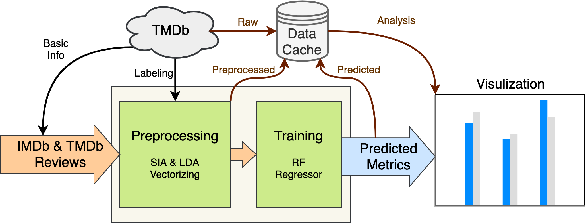

# Analysis of Correlation Between Movie Score and Public Reviews
## EECS6893-FinalProject-Group9

Proprosed and experimented a text-based movie score prediction system. 

## Authors
* Chengbo Zang (cz2678)
* Shengbo Chen (sc4918)
* Chenhao Wang (cw3355)

## Description



Our project aims to collect website reviews related to different movies, extract meaningful information and predict the actual votes. This will be helpful for the audiences to choose movies that are worth watching, as well as helping the cinemas to make more reasonable arrangements on movie schedules.

## Getting Started

### Dependencies

A few of the key tools and environments are listed as follows. 
* python=3.8.8
* ipykernel=5.3.4
* pyspark==3.1.2
* nltk=3.6.1
* numpy==1.19.5
* pandas=1.2.4
* matplotlib=3.3.4
* tmdbv3api==1.7.6
* IMDbPY==2021.4.18
* tweepy==3.9.0

For detailed evironments, see [requirements.txt](https://github.com/harrypotter1501/e6893-project/blob/d866675501389a6f5c81839729c7a25a762fa6f5/requirements.txt). 

### Execution

* For final visualization, 
```
#codes to run for visulization
```
* To see development interface, open and execute blocks in [development.ipynb](https://github.com/harrypotter1501/e6893-project/blob/d866675501389a6f5c81839729c7a25a762fa6f5/development.ipynb). 

## Directory Orgnization

```
.
├── README.md
├── config.py
├── data
│   ├── movies.csv
│   ├── movies_pp.csv
│   ├── predicts.csv
│   └── topics.txt
├── development.ipynb
├── environment.yml
└── utils
    ├── analysis.py
    ├── context.py
    ├── models.py
    ├── movies.py
    ├── preprocess.py
    ├── sparkStreaming.py
    ├── twitter.py
    └── twitterHTTPClient.py

2 directories, 16 files
```

## References

[1] T. Y.,. J. K. Márton Mestyán, "Early Prediction of Movie Box Office Success Based on Wikipedia Activity Big Data," PLoS ONE, vol. 8, no. 0071226, 2013.

[2] S. G. O. Beyza Çizmeci, "Predicting IMDb Ratings of Pre-release Movies with Factorization Machines Using Social Media," in (UBMK '18) 3rd International Conference on Computer Science and Engineering, Turkey, 2018.

[3] K. Z. Michael Lash, "Early Predictions of Movie Success: the Who, What, and When of Profitability," Journal of Management Information Systems, vol. 33, 2017.

[4] G. Verma and H. Verma, "Predicting Bollywood Movies Success Using Machine Learning Technique," in 2019 Amity International Conference on Artificial Intelligence (AICAI), Dubai, United Arab Emirates, 2019.

[5] Zahabiya Mhowwala. “Movie Rating Prediction using Ensemble Learning Algorithms” 2020.

[6] A. R. Rijul Dhir, "Movie Success Prediction using Machine Learning Algorithms and their Comparison," in 

[7] International Conference on Secure Cyber Computing and Communication (ICSCCC), India, 2018.

[8] Joe Cowell, “Predicting IMDb Movie Ratings using Supervised Machine” 2020.

[9] F. Abel, E. Diaz-Aviles, N. Henze, D. Krause and P. Siehndel, "Analyzing the Blogosphere for Predicting the Success of Music and Movie Products," in International Conference on Advances in Social Networks Analysis and Mining, Odense, Denmark, 2010.

[10] S. S. Magdum and J. V. Megha, "Mining Online Reviews and Tweets for Predicting Sales Performance and Success of Movies," in International Conference on Intelligent Computing and Control Systems (ICICCS), Madurai, India, 2017.

[11] “Sentiment Analysis: First Steps With Python's NLTK Library '' in realpython.com (accessed Dec.3,  2021).

[12] Parul Pandey,“Simplifying Sentiment Analysis using VADER in Python (on Social Media Text)” in medium.com, 2018.

[13] Apache, “Apache Spark - A unified analytics engine for large-scale data processing”. https://spark.apache.org (accessed Dec.3,  2021). 

[14] J. Roesslein, “Tweepy: Twitter for Python!”. https://Github.Com/Tweepy/Tweepy (accessed Dec.3,  2021).
D. Alberani, “IMDBPY is a Python package useful to retrieve and manage the data of the IMDb movie database about movies, people, characters and companies”. https://github.com/alberanid/imdbpy.git (accessed Dec.3,  2021).

[15] “The Movie Database”. https://www.themoviedb.org/ (accessed Dec.3,  2021). 

[16] S. Bird, E. Klein, and E. Loper, “Natural Language Processing with Python”. O’Reilly Media Inc. https://www.nltk.org/book (accessed Dec.3,  2021).

